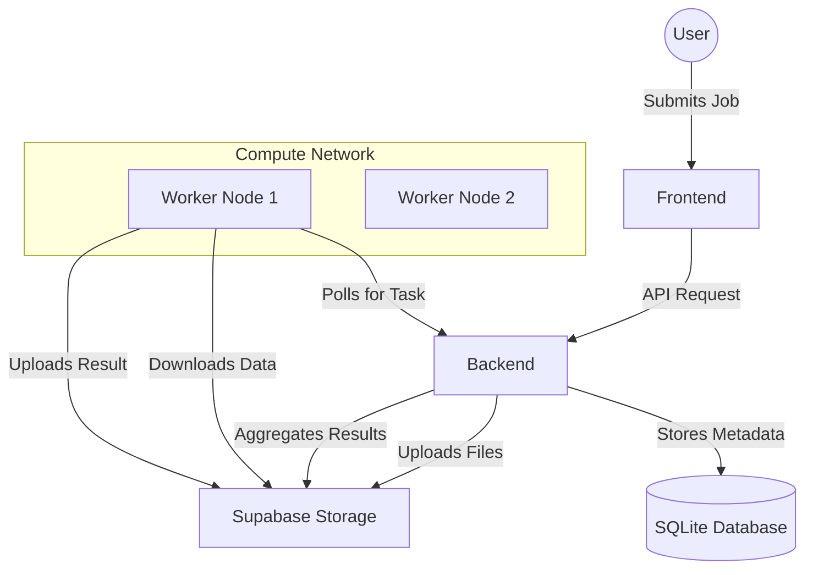

# Grid-X Project Documentation

Grid-X is a decentralized compute network platform enabling distributed machine learning training across a network of worker nodes.

---

## 🏗️ System Architecture

The system consists of three main components: **Backend**, **Worker**, and **Frontend**.



---

## 1. Backend (The Core)
The central nervous system of Grid-X. It handles authentication, job management, and orchestration.

*   **Language**: Python 3.10+
*   **Framework**: FastAPI (High-performance Async Framework)
*   **Database**: SQLite (`Grid-X.db`) via SQLAlchemy ORM
*   **Storage**: Supabase (Object Storage for large files like datasets and models)

### Key Modules:
*   `app/main.py`: Entry point, CORS config.
*   `app/models.py`: Database schema (Users, Agents, Jobs, Subtasks).
*   `app/routers/agent.py`: API for Workers (Heartbeat, Task Request, Result Upload).
*   `app/routers/front_job.py`: API for Frontend (Job Submission, Status).
*   `app/aggregation.py`: Federated Averaging logic (Pytorch-based).

### Networking Model:
*   **REST API**: Exposes HTTP endpoints (`/agent/...`, `/jobs/...`).
*   **Polling**: Does not push to workers; relies on workers polling for tasks.
*   **Sync/Async**: Uses standard synchronous DB calls but runs on `uvicorn` (ASGI).

---

## 2. Worker (The Compute Node)
Isolates and executes code securely. Can run on any machine (Laptop, Server, Raspberry Pi).

*   **Language**: Python 3.11
*   **Environment**: Docker (for sandboxing)
*   **Dependencies**: `requests`, `docker`, `torch`

### How it Works:
1.  **Registration**: On startup, registers with Backend via `POST /agent/register`.
2.  **Heartbeat**: Sends `POST /agent/heartbeat` every 5 seconds to say "I'm alive".
3.  **Polling**: Asks `POST /agent/request_task` every 10 seconds.
4.  **Execution**:
    *   Downloads Code (`train.py`) and Data (`data.csv`).
    *   Builds/Runs a Docker Container (`secure-executor-base`).
    *   Mounts a temporary volume.
    *   Runs `python train.py` inside the container.
5.  **Reporting**: Uploads `model.pth` and calls `POST /agent/complete_task`.

### Networking:
*   **Outbound Only**: Does not require open firewall ports. Connects OUT to Backend.
*   **Configuration**: Controlled via `worker_config.env` (Backend URL, Email).

---

## 3. Frontend (The Dashboard)
User interface for submitting jobs and viewing progress.

*   **Framework**: Next.js 16 (React Framework)
*   **Language**: TypeScript / JavaScript
*   **UI Library**: React 19
*   **Location**: `grid-x/packages/dashboard` (Monorepo structure)

---

## 🔄 Data Flow Overview

1.  **Job Submission**:
    *   User uploads `train.py`, `requirements.txt`, `data.csv`.
    *   Frontend sends to Backend.
    *   Backend uploads files to Storage and creates `Job` record.

2.  **Task Dispatch**:
    *   Worker asks for work.
    *   Backend checks DB for `PENDING` subtasks.
    *   Backend assigns task to Worker.

3.  **Execution & Result**:
    *   Worker processes data.
    *   Worker uploads `model.pth` to Storage.
    *   Worker notifies Backend.

4.  **Aggregation (FedAvg)**:
    *   When all subtasks are complete, Backend triggers `aggregation.py`.
    *   Backend downloads all `model.pth` files.
    *   Backend averages weights (Federated Learning).
    *   Backend saves `final_model.pth`.

---

## 🚀 Setup & Deployment

### Backend
```bash
cd backend
pip install -r requirements.txt
uvicorn app.main:app --reload
```

### Worker (Fresh Device)
Refer to [`WORKER_SETUP.md`] for detailed instructions.
1.  Move `gridx-worker.tar.gz` to device.
2.  Extract and run `./setup_worker.sh`.
3.  Run `./start_worker.sh`.

### Frontend
```bash
cd grid-x/packages/dashboard
npm install
npm run dev
```
